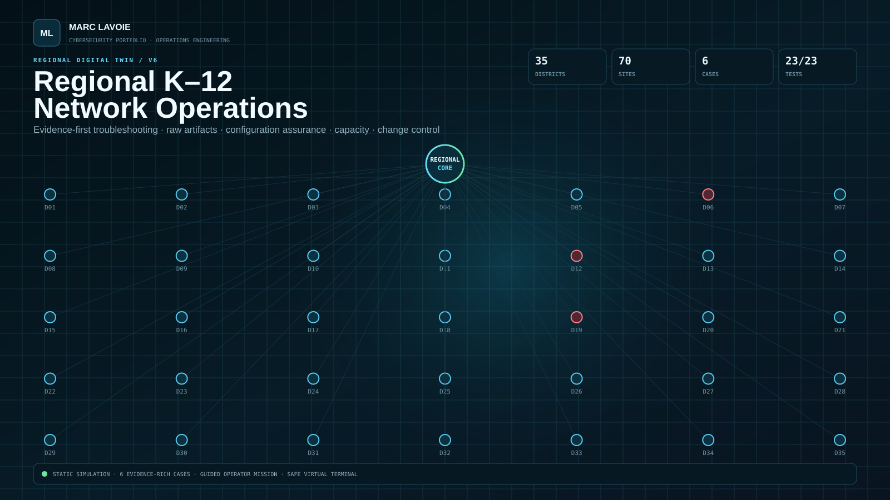

# Regional K–12 Network Operations Engineering — v6

> **Static synthetic operations environment.** Districts, users, tickets, telemetry, evidence, service metrics, and outcomes are fictional. No production school data, credentials, remote-control capability, or repository write path is included.



## Why v6 exists

v6 is built to the same interaction standard as the strongest projects in the surrounding cybersecurity portfolio: it should be understandable in seconds, demonstrable in minutes, and technically inspectable for much longer.

It is not a technology checklist. It is an **operator experience backed by repository evidence**.

A reviewer can move through three depths:

```text
PORTFOLIO LANDING PAGE
30-second value proposition
        │
        ▼
OPERATIONS CENTER
interactive operator workflow
        │
        ▼
REPOSITORY EVIDENCE
raw artifacts · scripts · configs · tests
```

## Launch points

1. Open **`index.html`** — scenario-driven portfolio experience.
2. Open **`dashboard/index.html`** — full Regional Operations Center.
3. Open **`case-studies/README.md`** — six evidence-rich investigations.
4. Run **`make check`** — validate code, data, public assets, evidence exports, and report freshness.

## v6 operator experience

### Portfolio landing page

- six switchable states: Normal, WAN, Security, Filter, Identity, Wireless;
- 35-node regional digital-twin preview;
- modeled health, priority, utilization, and packet-loss state;
- service-centric end-to-end architecture;
- six-case interactive evidence browser;
- safe virtual operations terminal;
- engineering-system and validation proof sections;
- explicit simulation/credibility boundary.

### Regional Operations Center

- shift briefing and drill mode selection;
- persistent guided mission progress;
- 72-hour synthetic telemetry replay;
- clickable 35-district digital twin and district inspector;
- guided evidence-first incident lab;
- raw Evidence Vault and handoff preview;
- service dependency and blast-radius explorer;
- configuration baseline/drift assurance;
- P95 capacity planning and forecast;
- change-risk, approval, rollback, and validation review;
- virtual terminal backed by the same static data model;
- architecture gallery.

## Modeled operating environment

- **35 synthetic districts / 70 sites**
- Windows 11, Windows Server, Linux, ChromeOS
- AD DS, Entra ID, Intune
- Microsoft 365 and Google Workspace
- VLANs, routed LAN/WAN, OSPF/BGP concepts
- MDF/IDF operations
- firewall and Internet filtering
- DNS, DHCP, NTP
- SNMPv3 and syslog monitoring
- NOC/provider/vendor escalation
- SLA analytics and capacity forecasting
- configuration compliance and drift
- change control and rollback
- evidence packaging and reproducible validation

## Featured investigations

| Case | Failure domain | Evidence-backed decision |
|---|---|---|
| `INC-WAN-01` | WAN/provider | local path proven healthy; fault isolated beyond provider handoff |
| `INC-FILTER-01` | Internet filtering | exact SaaS dependency identified; narrow exception validated |
| `INC-SEC-01` | segmentation | ACL ordering defect corrected; deny and legitimate-use paths both re-tested |
| `INC-DNS-01` | AD/DNS/DHCP | Layer-3 path healthy while client resolver configuration is wrong |
| `INC-WIFI-01` | wireless RF | local RF contention isolated from WAN/cloud availability |
| `INC-INTUNE-01` | Intune/identity | device compliance restored without weakening Conditional Access |

The case artifacts are embedded into the browser experience by `tools/export_v6_experience.py`; the public UI therefore displays the repository artifacts rather than separately maintained summaries.

## Operations CLI

```bash
python -m k12ops.cli validate --inventory data/districts.json
python -m k12ops.cli health --inventory data/districts.json --tickets data/tickets.json
python -m k12ops.cli triage --scenario data/scenarios.json --id INC-WAN-01
python -m k12ops.cli dependencies --services data/services.json --service svc-instructional
python -m k12ops.cli drift --baseline configs/compliance/baseline.json --snapshots data/config_snapshots.json
python -m k12ops.cli capacity --history data/capacity_history.json --top 10
python -m k12ops.cli sla --tickets data/tickets.json
python -m k12ops.cli change-risk --changes data/changes.json
python -m k12ops.cli telemetry --telemetry data/telemetry.json
python -m k12ops.cli bundle --case-dir case-studies/INC-WAN-01 --output /tmp/wan-evidence
```

## Browser data provenance

```text
data/*.json ----------------------┐
                                 ├─> tools/export_static_data.py -> portfolio/data.js
case-studies/*/evidence ----------┘
                                 └─> tools/export_v6_experience.py -> portfolio/v6-data.js

canonical repository data
        ↓
generated static browser model
        ↓
landing page + operations center
        ↓
validation checks for stale exports
```

No backend is required and the public pages use `connect-src 'none'` in Content Security Policy.

## Validation

Run:

```bash
make check
```

The release gate covers:

- Python unit tests;
- 35-district / 70-site inventory validation;
- base portfolio and case-study validation;
- v6 landing/Operations Center asset and DOM validation;
- all six embedded evidence cases;
- JavaScript syntax;
- Python compilation;
- generated browser-data freshness;
- enterprise-report freshness;
- static safety / no-external-request boundary.

## Portfolio integration

See:

- `docs/PORTFOLIO_INTEGRATION.md`
- `integration/project-card.html`
- `docs/V6_DEMO_SCRIPT.md`
- `docs/V6_EXPERIENCE_ARCHITECTURE.md`

The supplied project card uses the same class structure as the surrounding portfolio's existing project cards, so it can be inserted into the Network Engineering section after deploying this folder under `projects/k12-network-operations/`.

## Operating principle

```text
symptom
  ↓
scope
  ↓
known-good boundary
  ↓
raw evidence
  ↓
fault domain
  ↓
controlled change OR escalation
  ↓
positive verification
  ↓
negative/security verification
  ↓
documentation
  ↓
assurance and improvement
```

## Portfolio truth boundary

The 35-district scale is intentionally simulated. The portfolio proof is the **method, code, architecture, raw evidence structure, operational reasoning, automation, and validation**—not a claim that the fictional districts are production environments I administered.
