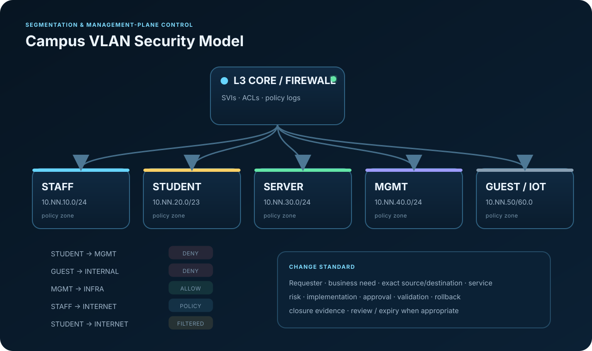

# INC-SEC-01 — Student-to-Management Segmentation Exposure

## Executive Summary

An authorized validation test detects unintended reachability from the STUDENT VLAN to a known switch management address. The test is kept narrowly scoped. Logs and ACL state are preserved before modification. Root cause is a misplaced permit sequence above the intended deny. The rule is corrected through the approved emergency-change workflow, then validated with both a **negative control** (student access must fail) and a **positive control** (authorized management access must still work).

## Evidence Files

- [`evidence/acl-before.txt`](evidence/acl-before.txt)
- [`evidence/security-event.json`](evidence/security-event.json)
- [`evidence/acl-after.txt`](evidence/acl-after.txt)
- [`validation.txt`](validation.txt)
- [`incident-report.md`](incident-report.md)
