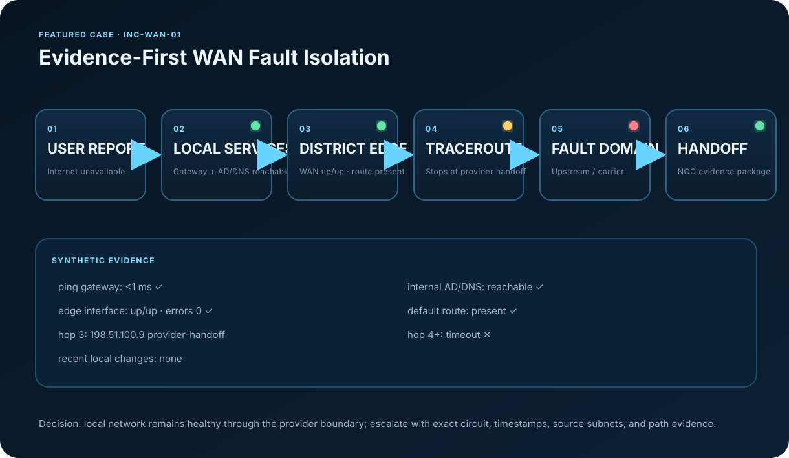

# INC-WAN-01 — High School Internet Outage

## Executive Summary

Two independent client VLANs at a fictional high school lose Internet access while local AD/DNS, switching, and the default gateway remain healthy. The investigation establishes a known-good boundary through the district edge and shows the path failing immediately after the provider handoff. No local infrastructure change is required; the incident is escalated with a complete evidence package.

## Initial Report

> “The high school cannot get to the Internet. The internal file/application services still work.”

## Scope

- District: `DIST-02`
- Site: `DIST-02-HS`
- Severity: P2
- Affected: STAFF and STUDENT VLAN clients
- Unaffected: local AD/DNS, internal application service, gateway
- Start: 2026-09-02 10:02 PT (synthetic)

## Investigation

1. Reproduced from one STAFF and one STUDENT client.
2. Confirmed DHCP configuration and local DNS service.
3. Confirmed default gateway reachable in <1 ms.
4. Confirmed district edge WAN interface is `up/up` with no error growth.
5. Confirmed default route remains installed.
6. Traceroute reaches the provider handoff `198.51.100.9` and fails beyond it.
7. Checked change records: no approved local WAN/firewall change in the previous 24 hours.
8. Escalated to the upstream NOC/carrier with source networks, circuit ID, timestamps, path evidence, and requested action.

## Root-Cause Decision

**Fault domain:** upstream WAN/provider path.

The important point is not that traceroute timed out. The decision is based on the combination of two affected VLANs, healthy local services, healthy gateway, healthy edge interface, present default route, and a consistent failure boundary at the provider handoff.

## Evidence Files

- [`evidence/client-tests.txt`](evidence/client-tests.txt)
- [`evidence/traceroute.txt`](evidence/traceroute.txt)
- [`evidence/edge-interface.txt`](evidence/edge-interface.txt)
- [`evidence/snmp-alert.json`](evidence/snmp-alert.json)
- [`escalation.md`](escalation.md)
- [`closure.md`](closure.md)
