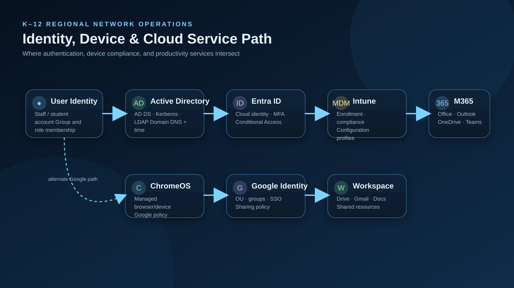
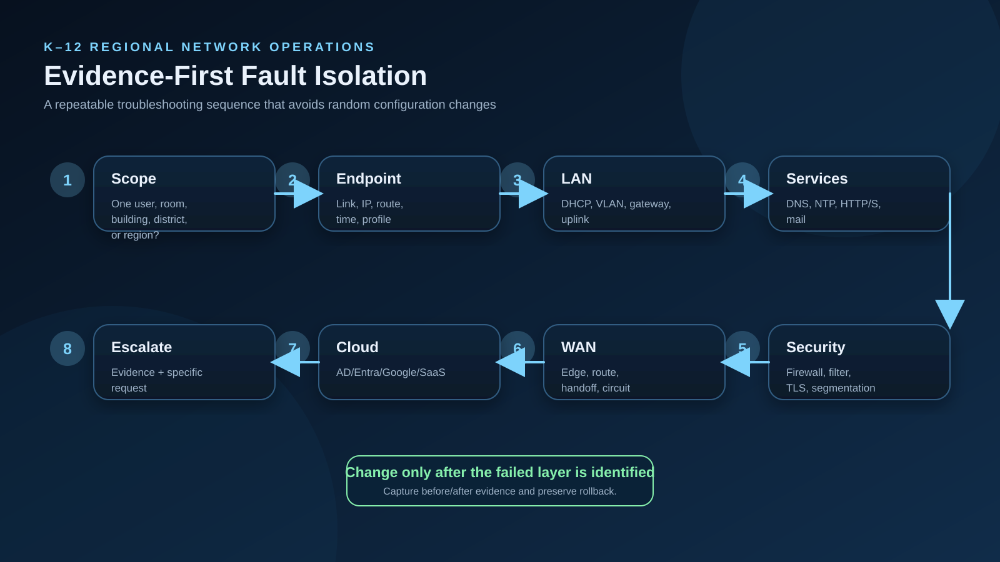

# Architecture


## Design Goal

Model a regional K–12 support environment without depending on proprietary production systems.

## Logical Layers

```text
USER / DEVICE
     |
     v
Endpoint Layer
Windows | Linux | ChromeOS
     |
     v
Identity Layer
AD DS | Entra ID | Google Identity
     |
     v
LAN Layer
Access Switch -> IDF -> MDF -> L3 Core
     |
     v
Security Layer
Firewall -> DNS Policy -> Internet Filter
     |
     v
WAN Layer
District Edge -> Provider/K-20 -> Internet
     |
     v
Cloud Layer
Microsoft 365 | Google Workspace | SaaS
```

## Fault Domains

1. Endpoint
2. Local authentication
3. Cloud authentication
4. DHCP
5. DNS
6. Access switching
7. VLAN / trunk
8. Layer-3 gateway
9. Firewall
10. Web filter
11. District WAN
12. Upstream provider
13. SaaS provider

Each ticket should be narrowed to a fault domain before a configuration change is proposed.

## Multi-District Model

A fictional `district_id` is used in documentation so ticket records can be separated by customer while keeping a consistent support methodology.

Example:

```text
DIST-01
DIST-02
...
DIST-35
```

## Security Principles

- Least privilege
- Read-only diagnostics first
- No shared administrator credentials
- Separate student/staff/admin network segments
- Narrow web-filter exceptions
- Change approval for infrastructure modification
- Centralized logging
- Backout plan for every high-impact change
- Evidence package before upstream escalation


## Identity and Cloud Architecture



## Operational Fault Isolation


