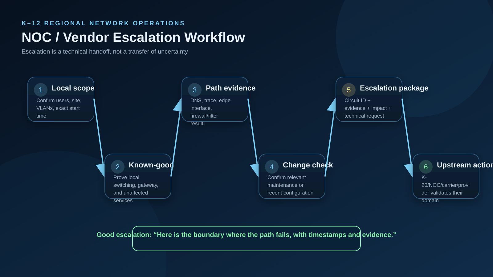

# Five-Minute Interview Demonstration

## Minute 1 — Architecture

Show `dashboard/index.html` and explain the fault domains. Emphasize that the project models 35 districts with a repeatable support method.

## Minute 2 — Incident

Load **School-wide Internet outage**. Explain that local services and the default gateway are reachable, which moves the investigation toward the WAN edge/provider rather than reinstalling endpoints.

## Minute 3 — Tooling

Show:

```bash
python -m k12ops.cli triage --scenario data/scenarios.json --id INC-WAN-01
```

Then show the evidence package the scenario expects.

## Minute 4 — Escalation

Open `docs/VENDOR_ESCALATION_TEMPLATE.md`. Explain how source, destination, timestamps, traceroute, circuit ID, and recent changes allow an upstream NOC to act immediately.

## Minute 5 — Operations Maturity

Show the change template, monitoring thresholds, unit tests, and GitHub validation workflow. Explain that the goal is repeatable support, not one-off command memorization.

## Closing Statement

> The project demonstrates how I approach K–12 support as an end-to-end service problem. I isolate the failed layer, collect evidence before changing configuration, make the smallest appropriate change, validate the result from the user's perspective, and provide an actionable escalation when the fault is outside my administrative boundary.


## Visual Walkthrough Sequence

For a screen-share or in-person interview, open the dashboard **Architecture** tab and use this sequence:

1. Regional topology — establish the complete service path.
2. Fault isolation — explain how you determine the failing layer.
3. VLAN segmentation — discuss K–12 trust boundaries and least privilege.
4. Identity/cloud — cover AD, Entra, Intune, Microsoft 365, Google, and ChromeOS.
5. NOC escalation — demonstrate evidence quality and upstream coordination.


