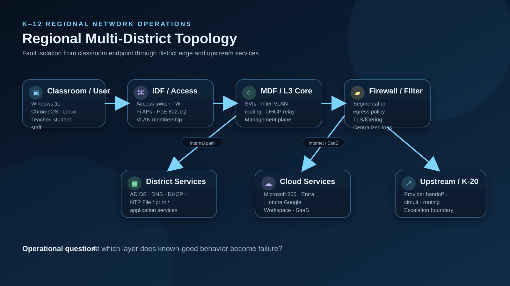
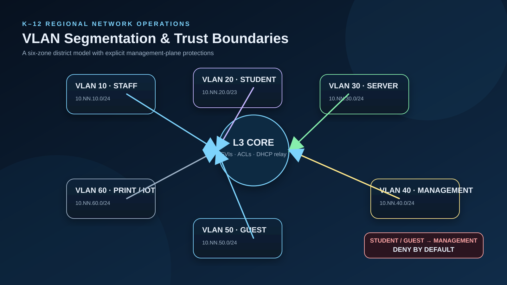
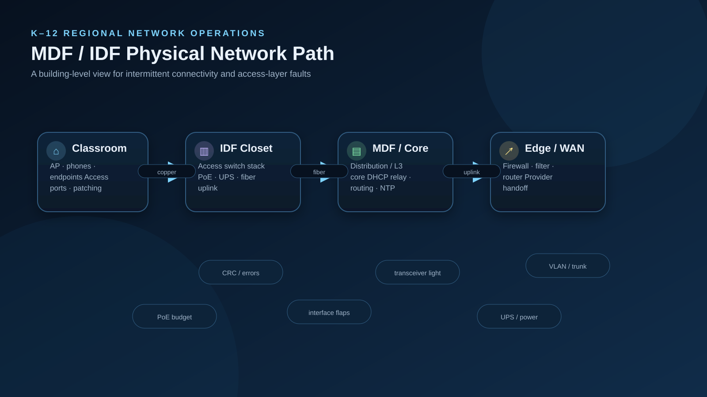

# Regional Network Design



## Regional Pattern

Each fictional district follows a repeatable design so troubleshooting methods can scale without pretending every school is identical.

```text
                    Regional / Upstream Education Network
                                  |
                         [District WAN Edge]
                                  |
                          [Firewall / Filter]
                                  |
                           [L3 Core / MDF]
                   _____________|_____________
                  |             |             |
               STAFF         STUDENT        SERVER
                  |             |             |
              IDF/access    IDF/access     AD/DNS/etc.
```

## Addressing Standard

District `NN` uses `10.NN.0.0/16` in the simulation.

| VLAN | Function | Example District 7 |
|---:|---|---|
| 10 | Staff | 10.7.10.0/24 |
| 20 | Student | 10.7.20.0/23 |
| 30 | Server | 10.7.30.0/24 |
| 40 | Management | 10.7.40.0/24 |
| 50 | Guest | 10.7.50.0/24 |
| 60 | Printer/IoT | 10.7.60.0/24 |

## Routing Principles

- Layer-3 gateway at the district core.
- Default route toward the district firewall/edge.
- Explicit management-plane restrictions.
- Student/guest isolation from management networks.
- Dynamic routing may be used upstream; the lab documents OSPF/BGP concepts without requiring a particular vendor.
- Route changes are validated from both the control plane and an affected client path.

## Fault Localization

If local server access works but Internet fails, focus above the L3 core. If a single VLAN fails while another works, compare SVI state, ACLs, DHCP scope, and access/trunk membership before escalating to the provider.


## VLAN Trust Boundaries



## MDF / IDF Physical Path


